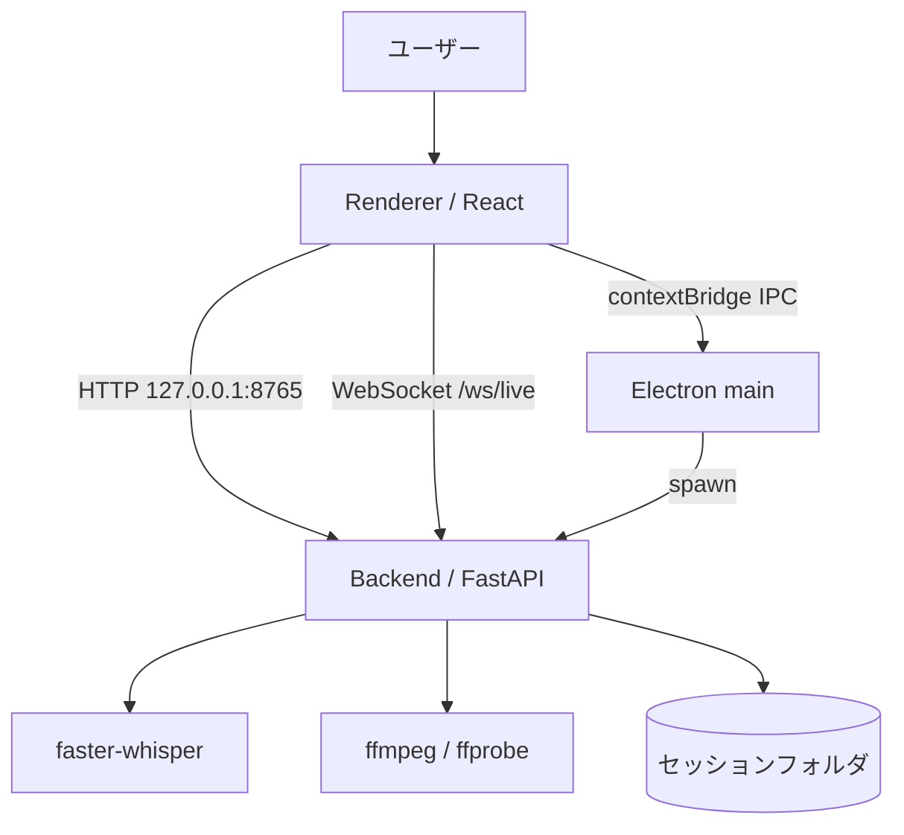
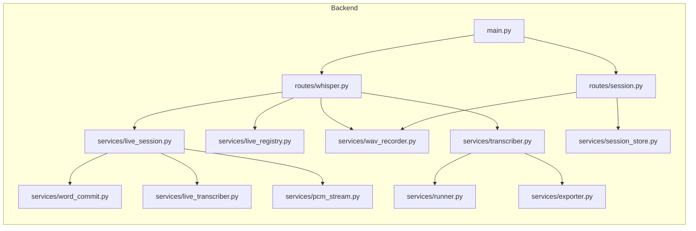
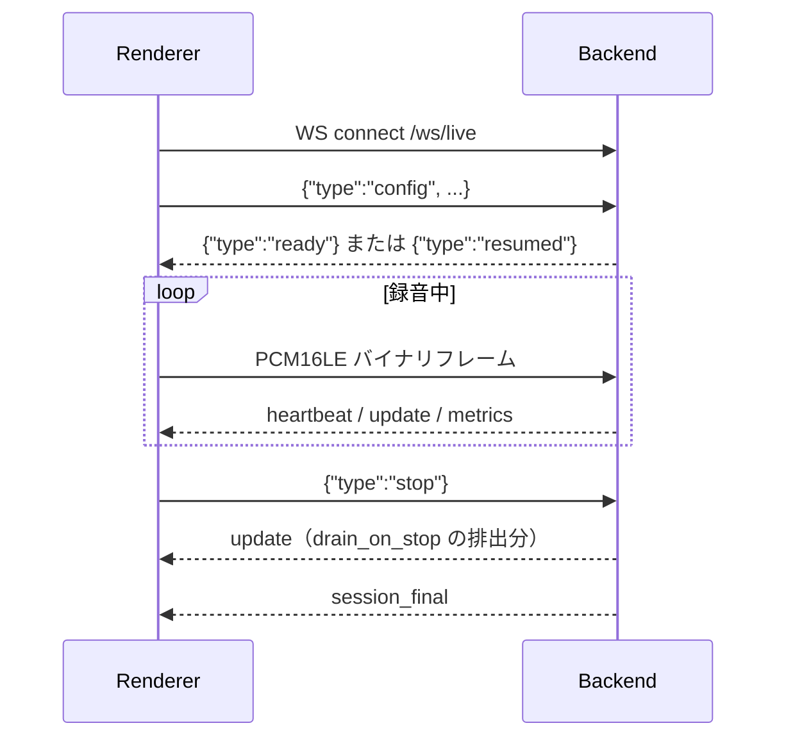

# 01. アーキテクチャ

> 本書はリポジトリ内のソースコードのみを根拠にしています。

## 全体構成

3 プロセス構成です。

| プロセス | 実体 | 起動元 |
|---|---|---|
| Electron main | `electron/main.ts` → `electron/dist/main.cjs` | ユーザー / `npm run dev` |
| Renderer (React) | `frontend/src/main.tsx` | Electron main |
| Backend (FastAPI) | `backend/main.py` | Electron main が子プロセスとして起動 |

根拠: `electron/backend.ts`（spawn）、`electron/preload.ts`（origin）、`backend/main.py`（ルータ登録）。

## レイヤ構造

### Backend

| レイヤ | ディレクトリ | 責務 |
|---|---|---|
| エントリ | `backend/main.py` | FastAPI 生成・CORS・ルータ登録・`/api/health` |
| ルート | `backend/routes/` | HTTP / WebSocket のエンドポイント |
| サービス | `backend/services/` | 文字起こし・セッション・録音・確定判定 |
| パッケージング | `backend/packaging/` | PyInstaller のエントリと spec |
| テスト | `backend/tests/` | `unittest` |

### Electron

| ファイル | 責務 |
|---|---|
| `electron/main.ts` | BrowserWindow 生成、終了確認、スリープ抑止、異常通知 |
| `electron/preload.ts` | `contextBridge` で `window.bridge` を公開 |
| `electron/backend.ts` | Backend の起動・監視・再起動・ログ保持 |
| `electron/backend-lifecycle.ts` | 終了理由の分類、single-flight、自Backend判定 |
| `electron/ipc/handlers.ts` | `ipcMain.handle` の登録 |
| `electron/ipc/diagnostics.ts` | Backend に依存しない diagnostics.log 追記 |
| `electron/ipc/openExternal.ts` | 許可ホストのみ外部 URL を開く |
| `electron/ipc/settingsMigration.ts` | 旧 BridgeLog 設定の移行判定 |
| `electron/ipc/handlers.ts`（0018） | ウィンドウ不透明度の IPC と適用（`window:setOpacity`） |

### Frontend

| ディレクトリ | 責務 |
|---|---|
| `frontend/src/components/` | UI 部品と、UI から分離した純関数 |
| `frontend/src/features/transcription/` | リアルタイム文字起こしのロジック |
| `frontend/src/services/` | Backend API 呼び出しと依頼文生成 |
| `frontend/src/types/` | `window.bridge` の型定義 |

## モジュール関係

根拠: 各ファイルの `import` 文。

## データフロー

### リアルタイム文字起こし

根拠: `backend/routes/whisper.py:671-800`、`frontend/src/features/transcription/useLiveTranscription.ts`。

### 音声フォーマット

| 項目 | 値 | 根拠 |
|---|---|---|
| サンプルレート | 16000 Hz | `backend/services/pcm_stream.py:12` |
| サンプルあたりバイト数 | 2（PCM16LE） | `backend/services/pcm_stream.py:13` |
| チャンネル | mono | `backend/services/pcm_stream.py` docstring |
| 送信モード | `pcm16`（`full` はサーバ側で拒否） | `backend/routes/whisper.py:689` |

`send_mode: "full"` は「O(T^2) のため realtime では使用しません」としてサーバがエラーを返し接続を閉じます。

### 保存されるファイル

`backend/services/session_store.py` の定数に基づきます。

| ファイル | 定数 |
|---|---|
| `transcript.txt` | `TRANSCRIPT_FILENAME` |
| `transcript_segments.json` | `SEGMENTS_FILENAME` |
| `session.json` | `SESSION_FILENAME` |
| `diagnostics.log` | `DIAGNOSTICS_FILENAME` |
| `audio/recording.wav` | `AUDIO_DIRNAME` / `RAW_AUDIO_FILENAME` |

## API 構成

| ルータ | prefix | 定義 |
|---|---|---|
| `whisper_router` | `/api/whisper` | `backend/routes/whisper.py:19` |
| `whisper_live_router` | なし（`/ws/live`） | `backend/routes/whisper.py:20` |
| `session_router` | `/api/session` | `backend/routes/session.py:15` |
| ヘルスチェック | `/api/health` | `backend/main.py` |

詳細は [`06_API_REFERENCE.md`](06_API_REFERENCE.md) を参照してください。

## 状態管理

状態管理ライブラリ（Redux / Zustand / Jotai / MobX / React Query 等）は
`package.json` に**存在しません**。React 標準の Hooks のみを使用しています。

| 状態 | 保持場所 | 根拠 |
|---|---|---|
| UI 状態（タイトル・モデル等） | `useState` / `useRef` | `frontend/src/App.tsx:59-84` |
| 文字起こしセッション状態 | `LiveStatus` 判別可能ユニオン | `frontend/src/features/transcription/liveTypes.ts` |
| 永続設定 | `koenote-settings.json`（userData）。**書き手は main のみ** | `electron/ipc/handlers.ts` |
| 入力デバイスの解決結果 | `ResolvedInputDevice`（純関数の戻り値） | `frontend/src/features/transcription/inputDevice.ts` |
| 画面上部の通知 | `UiNotice`（`kind` 付き判別可能ユニオン） | `frontend/src/components/uiNotice.ts` |
| ウィンドウ不透明度 | 設定ファイル。起動時は main が表示前に適用 | `electron/main.ts` |
| Backend 側セッション | `LiveSessionRegistry`（メモリ） | `backend/services/live_registry.py` |
| ジョブ状態（File Trans） | モジュール変数 `_jobs` + `threading.Lock` | `backend/routes/whisper.py:22-23` |

`LiveSessionRegistry` は「WebSocket が切れても LiveSession を保持し、再接続で同じセッションに戻す」ためのものです（同ファイル docstring）。

## 通信方法

| 経路 | 方式 | 根拠 |
|---|---|---|
| Renderer → Electron main | `contextBridge` + `ipcRenderer.invoke` / `send`（`ipcMain.handle` 13 件 + `ipcMain.on` 2 件） | `electron/preload.ts`, `electron/ipc/handlers.ts`, `electron/main.ts` |
| Electron main → Renderer | `webContents.send`（`backend:exited`, `backend:restartRequested`） | `electron/preload.ts` の購読定義 |
| Renderer → Backend（HTTP） | `fetch` で `http://127.0.0.1:8765` | `frontend/src/services/api.ts` |
| Renderer → Backend（WS） | `ws://127.0.0.1:8765/ws/live` | `frontend/src/services/api.ts` |
| Electron main → Backend | `spawn` による子プロセス起動 | `electron/backend.ts` |

### 再接続とウォッチドッグの定数

`frontend/src/features/transcription/useLiveTranscription.ts` に定義された値です。

| 定数 | 値 |
|---|---|
| `RECONNECT_BACKOFF_MS` | `[500, 1000, 2000, 4000, 8000]` |
| `HEARTBEAT_TIMEOUT_MS` | `8000` |
| `CAPTURE_TIMEOUT_MS` | `3000` |
| `TRANSCRIPTION_STALL_MS` | `60000` |
| `STARTUP_GRACE_MS` | `15000` |
| `WATCHDOG_TICK_MS` | `1000` |
| `SESSION_FINAL_TIMEOUT_MS` | `10000` |
| `PENDING_CAP_SAMPLES` | `60 * CAPTURE_SAMPLE_RATE` |
| `SEND_BUFFERED_LIMIT` | `4 * 1024 * 1024` |

### Backend 側の遅延プリセット

`backend/services/live_session.py:40` の `DELAY_PRESETS` です。

| delay_mode | chunk_seconds | overlap_seconds |
|---|---|---|
| `low_latency` | 8.0 | 2.0 |
| `balanced` | 10.0 | 2.0 |
| `accuracy` | 12.0 | 3.0 |

| 定数 | 値 | 用途（コメントより） |
|---|---|---|
| `BUFFER_CAPACITY_SECONDS` | 180.0 | 推論が遅れたときに音声を捨てずに追いつける猶予 |
| `MIN_FLUSH_TAIL_SECONDS` | 0.5 | 停止時にこれ未満の端切れなら 1 窓回さない |
| `MAX_DEGRADE_LOG_LINES` | 200 | 診断ログの保持行数 |
| `LAG_CATCHUP_THRESHOLD_SECONDS` | 30.0 | 超過時に overlap を捨ててスループットを稼ぐ |
